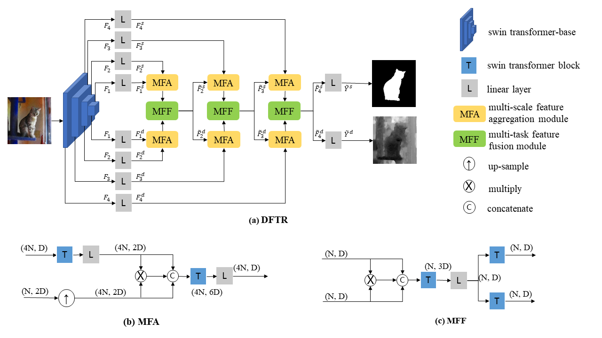

# DFTR: Depth-supervised Hierarchical Feature Fusion Transformer for Salient Object Detection | arXiv

[](https://github.com/heqin-zhu/DFTR/stargazers)
[](.)
[](LICENSE)

<!-- [](https://paperswithcode.com/sota/TODO) -->
<!--  [](http://creativecommons.org/licenses/by-nc-sa/4.0/)  copy LICENCE -->
<!-- []()  -->

PyTorch implementation
<!-->
for our CVPR 2022 paper:
DFTR: Depth-supervised Hierarchical Feature Fusion Transformer for Salient Object Detection
Heqin Zhu, Xu Sun, Yuexiang Li, Ka ma, S.Kevin Zhou, Yefeng Zheng
<-->



## Abstract
Automated salient object detection (SOD) plays an increasingly crucial role in many computer vision applications. Although existing frameworks achieve impressive SOD performances especially with the development of deep learning techniques, their performances still have room for improvement. In this work, we propose a novel pure Transformer-based SOD framework, namely Depth-supervised hierarchical feature Fusion TRansformer (DFTR), to further improve the accuracy of both RGB and RGB-D SOD. The proposed DFTR involves three primary improvements: 1) The backbone of feature encoder is switched from a convolutional neural network to a Swin Transformer for more effective feature extraction; 2) We propose a multi-scale feature aggregation (MFA) module to fully exploit the multi-scale features encoded by the Swin Transformer in a coarse-to-fine manner; 3) Following recent studies, we formulate an auxiliary task of depth map prediction and use depth maps as extra supervision signals for network learning. To enable bidirectional information flow between saliency and depth branches, a novel multi-task feature fusion (MFF) module is integrated into our DFTR. We extensively evaluate the proposed DFTR on ten benchmarking datasets. Experimental results show that our DFTR consistently outperforms the existing state-of-the-art methods for both RGB and RGB-D SOD tasks.
          
## Requirements
- python3.6+
- python modules
    - torch
    - torchvision
    - numpy
    - timm
    - opencv-python
    - tqdm
    - scipy

Install:

```shell
pip3 install -r requirements.txt
```

## Preparation
### RGB-D SOD Datasets
- Training set
    - NJU2K: 1,500 images
    - NLPR: 700 images
- Testing set
    - NJU2K: 485 images
    - NLPR: 300 images
    - STERE: 1,000 images
    - SIP: 929 images
    - SSD: 80 images

The trainset was prepared by using script [split\_trainset.py](./data/split_trainset.py).

### RGB SOD Datasets
- Training set
    - [DUTS](http://saliencydetection.net/duts/): 10,553 images
- Testing set
    - [DUTS](http://saliencydetection.net/duts/): 5019 images
    - [ECSSD](http://www.cse.cuhk.edu.hk/leojia/projects/hsaliency/dataset.html): 1,000 images
    - [HKU-IS](https://i.cs.hku.hk/~gbli/deep_saliency.html): 4,447 images
    - [PASCAL-S](http://cbi.gatech.edu/salobj/): 850 images
    - [DUT-OMRON](http://saliencydetection.net/dut-omron/): 5,168 images

Download the above datasets from [Release](https://github.com/heqin-zhu/DFTR/releases/tag/v0.1) and unzip them in `data` folder.

**The following resources, including checkpoints and saliency maps, can be downloaded from either [Release](https://github.com/heqin-zhu/DFTR/releases/tag/v0.1) or [Google Drive](https://drive.google.com/drive/folders/1oDOTBfGG2mKK8OP7rJYsaJsZotaH6GnA?usp=sharing).**

### Checkpoints
Re-train DFTR from scratch with [Swin Transformer (base)](https://github.com/SwinTransformer/storage/releases/download/v1.0.0/swin_base_patch4_window7_224_22kto1k.pth) checkpoint or load our pre-trained [DFTR-RGB](https://github.com/heqin-zhu/DFTR/releases/download/v0.1/DFTR_RGB.pth) or [DFTR-RGBD](https://github.com/heqin-zhu/DFTR/releases/download/v0.1/DFTR_RGBD.pth). Download checkpoint and place it in `data` folder.

## Training, Testing, and Evaluation
Firstly, change current working directory as `codes` by running `cd codes`.

```shell
# RGBD

# Train DFTR from scratch or a checkpoint
python3 main.py -d RUN_DIR -r RUN_NAME -p train [ -c CHECKPOINT_PATH ]
python3 main.py -d ../runs -r DFTR -p train -c ../data/DFTR_RGBD.pth

# After Training, the program will automatically run test (inference) and evaluate predicted maps.
# Yet you can manually test and evalute as follows:

# Test
python3 main.py -d RUN_DIR -r RUN_NAME -p test [ -c CHECKPOINT_PATH ] [ -C CONFIG ]
python3 main.py -d ../runs -r DFTR -p test # make sure ../runs/DFTR contains trained files, otherwise
python3 main.py -d ../tmp -r tmp -p test -c ../data/DFTR_RGBD.pth

# evaluate
python3 main.py -d ../run_rgbd -r run_DFTR -p eval

```
Switch to RGB by editing variables `train_names` and `test_names` in [config.yaml](./codes/config.yaml).

Please run `python3 main.py -h` to see more arguments and details or modify `config.yaml` to set different configurations.

## Saliency Map Results
The [RGB](https://github.com/heqin-zhu/DFTR/releases/download/v0.1/DFTR_RGB_Saliency_Maps.zip) and [RGBD](https://github.com/heqin-zhu/DFTR/releases/download/v0.1/DFTR_RGBD_Saliency_Maps.zip) saliency maps predicted by our DFTR are available publicly.

## Citation
If you find our work is helpful, please cite 
```
```

## Acknowledgment
